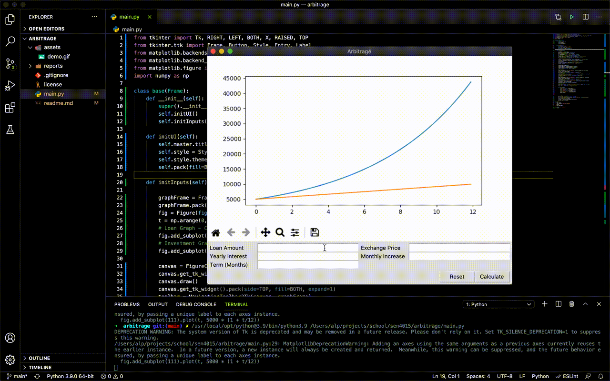

# Project Arbitragé
Statistical analysis tool for calculating term-earnings for differences in different commodities.

## Dependencies
> pip3 install PyQt5

> py3 arbitrage_gui.py

## Future Works
- Migrate to Tkinter for lighter experience and cleaner code.
- Get inputs from fields and apply it to formula.
- Split up window components.
- Intergate embedded graphing library
