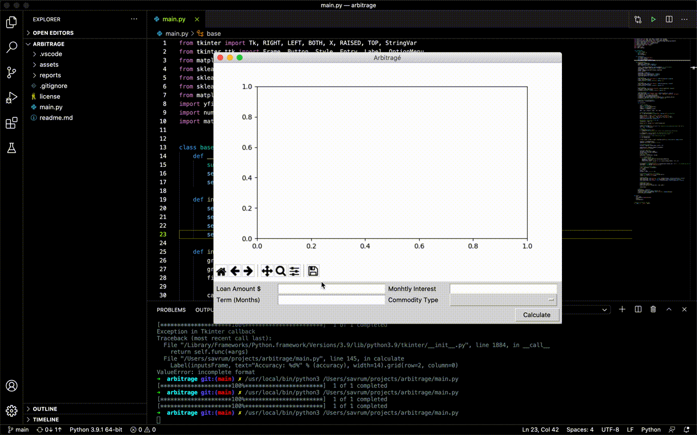

# Project Arbitragé
Statistical analysis tool for calculating term-earnings for differences in different commodities.

## Dependencies

> py3 main.py

## Changelog
- Migrated to Tkinter.
- Input-relations are completed.
- Written base component for window and widgets.
- Integrated matplotlib.

## Future Works
- Apply input values to graph.
- Implement formula.
- Resizing slows down app, try to fix. (matplotlib bug)
- Try to implement Monte-Carlo method.
